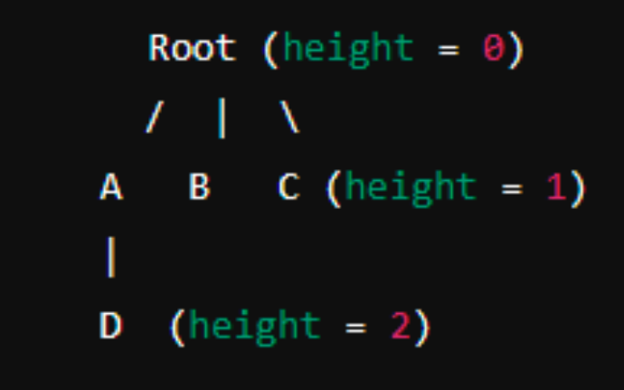

# Intro

We need to map out how our company is structured so we can do all the awesome things we dream of. Imagine our company as a giant tree, where the root is our starting point and every branch (or node) connects back to it. Here is how it goes:

# The Tree

- There's one root node to rule them all.
- Beneath it, tons of children nodes, each with their own children (you guessed it,
  sub-nodes).
- It is a beautiful tree structure with levels and connections, and we need to manage
  this like pros.

So, we need two HTTP APIs to help us navigate and manage this tree:

1. Get all children nodes of a given node (the given node can be anyone in the tree structure).
2. Move a node around the tree. Change the parent node of a given node (the given node can be anyone in the tree structure).

# Something to consider...

These APIs need to be lightning fast, even if we’re dealing with a jungle of nodes. Plus, we
can not lose any data, so we need to make sure this info sticks around - persistence of data.

# Every node should have the following information

1. Node ID
2. Its parent’s ID
3. The ID of the root node
4. Its height in the tree (like, shown in the image. Root’s at height 0, next level is 1,
   etc.).

# Oh, and one last thing...

Sadly, we are limited to just Docker and docker-compose on our machines, so your server will need to be set up using those.
